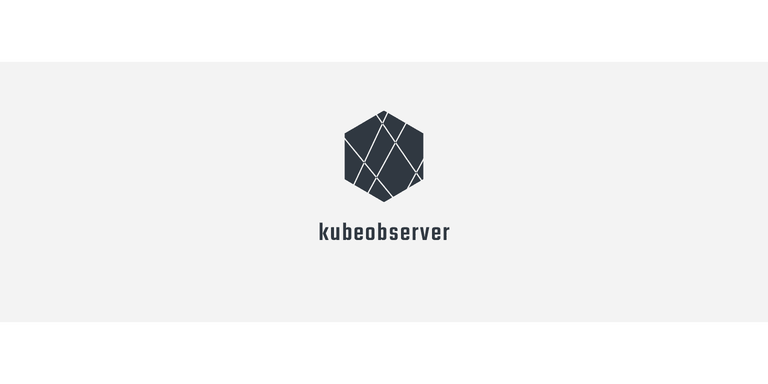

# 

Observe Kubernetes events, collect metrics & trigger endpoint receivers

## Quick Start

## Configuration

### Kubeobserver configuration

Kubeobserver is configure throw environment variables. 

| Variable name | Mandatory | Description | Default |
| --- | --- | --- | --- |
| K8S_CLUSTER_NAME | true | the cluster name kubeobserver deployed to (for example: "dev-clsuster") | - |
| EXCLUDE_POD_NAME_PATTERNS | false | comma separated string. pod watcher will ignore pods that has one or more of this values inside the pod name (for example, when EXCLUDE_POD_NAME_PATTERNS="runner" pod name "ruuner-353332dsdsa" will be ignored) | empty-string |
| SLACK_CHANNEL_NAMES | false | slack channels for slack recevier to publish events | empty-string |
| SLACK_TOKEN | false | slack bot app token for slack recevier | empty-string |
| K8S_CONF_FILE_PATH | false | when running kubeobserver outside of k8s cluster, this can be used to specify the path for k8s config file | empty-string |
| DEFAULT_RECEIVER | false | dfgfdgfd | "slack" |
| PORT | true | http server port kubeobserver listen on | - |

### Client settings
ֿ
When kubeobserver is running inside k8s, client (pods, config-maps and so on) can define what to watch and which receviers they want to use.<br>
The configuration is made by using k8s controller annotations under the root template, for example:

```bash
...
 template:
    metadata:
      labels:
        app: {{ template "name" . }}
    annotations:
        pod-init-container-kubeobserver.io/watch: true
        kubeobserver.io/receivers "slack,alert-manager"
...        
```

<b>Note: if annotations are not defined, default values will be used basebased on kubeobserver configuration</b><br>


| Controller name | Annotation | Value type | Description | Default |
| --- | --- | --- | --- | --- |
| pod-watcher | pod-init-container-kubeobserver.io/watch | boolean | pod watcher will trigger events for init containers related to the pod | false |
| *All* | kubeobserver.io/receivers | comma separated string | bla bla bla | default recevier is defined in kubeobserver using DEFAULT_RECEIVER env variable |
