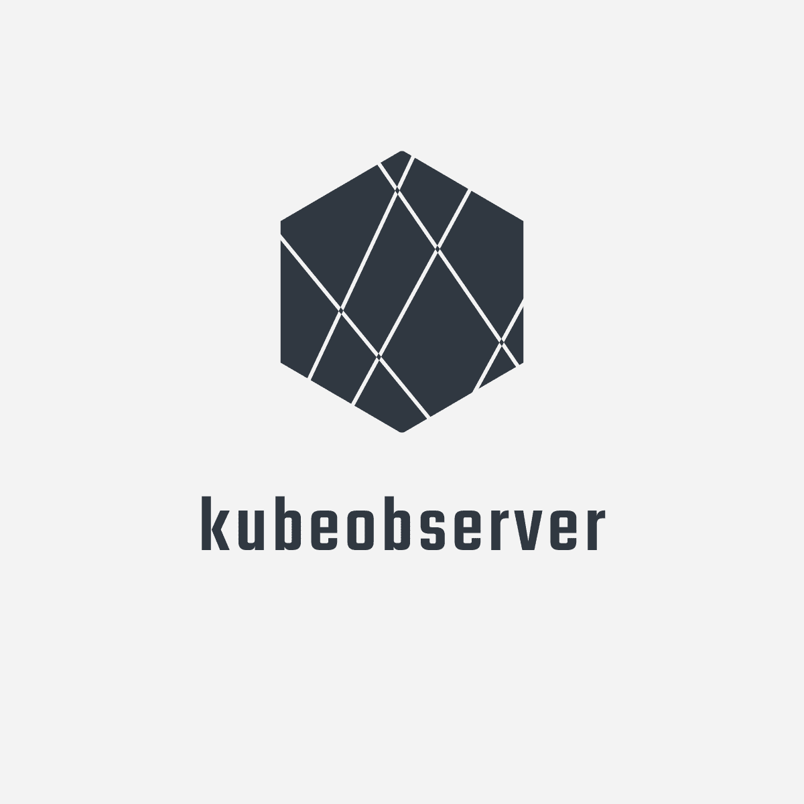

# 

Observe Kubernetes events, collect metrics & trigger endpoint receivers

## Run Locally

```console
# First, download and install kubewatch using go package installer
$ go get -u -v github.com/PayU/kubeobserver
$ cd ~/go/src/github.com/PayU/kubeobserver
```

#### Build from Scratch

```bash
$ make build
$ ./kubeobserver
```

#### Run local inside docker
```bash
$ docker build .
$ docker run -v <local_path_to_kube_config>:/home -e PORT=8000 -e K8S_CLUSTER_NAME=cluster-name -e K8S_CONF_FILE_PATH=/home/config -p 8000:8000 <docker_image_id>
```

## Configuration

### Kubeobserver Configuration

Kubeobserver is configurable through environment variables.

| Variable name | Mandatory | Description | Default |
| --- | --- | --- | --- |
| K8S_CLUSTER_NAME | true | the cluster name kubeobserver deployed to (for example: "dev-cluster") | - |
| EXCLUDE_POD_NAME_PATTERNS | false | a comma separated string of values to be ignored by the podWatcher. Any pod that has one of these values in its name will be ignored (for example, when EXCLUDE_POD_NAME_PATTERNS="runner" pod name "ruuner-353332dsdsa" will be ignored | empty-string |
| SLACK_CHANNEL_NAMES | false | a comma separated string of slack channel IDs for slack receiver to publish events to | empty-string |
| SLACK_TOKEN | false | slack bot app token for slack recevier | empty-string |
| K8S_CONF_FILE_PATH | false | outside of a k8s cluster", "a k8s config file | empty-string |
| DEFAULT_RECEIVER | false | name of the default recevier for all controller watchers | "slack" |
| WATCHER_THREADS | false | number of goroutines for each controller watcher | 10 |
| PORT | true | http server port kubeobserver listens on | - |

### Client settings

When kubeobserver is running inside k8s, client (pods, config-maps and so on) can define what to watch and which receviers they want to use.<br>
The configuration is made by using k8s controller annotations under the root template, for example:

```bash
...
 template:
    metadata:
      labels:
        app: {{ template "name" . }}
    annotations:
        pod-init-container-kubeobserver.io/watch: true
        kubeobserver.io/receivers "slack,alert-manager"
...        
```

<b>Note: if annotations are not defined, default values will be used based on kubeobserver configuration</b><br>


| Controller name | Annotation | Value type | Description | Default |
| --- | --- | --- | --- | --- |
| pod-watcher | pod-kubeobserver.io/ignore | boolean | pod watcher will ignore the pod events | false |
| pod-watcher | pod-init-container-kubeobserver.io/watch | boolean | pod watcher will trigger events for init containers related to the pod | false |
| *All* | kubeobserver.io/receivers | comma separated string | a comma separated string of recevier names that the events will be publish to. unknown names will be ignored | default recevier is defined in kubeobserver using DEFAULT_RECEIVER env variable |
| pod-watcher | pod-update-kubeobserver.io/ignore | boolean | pod watcher will ignore 'Update' events and notify only on 'Add'/'Delete' events | false |
| pod-watcher | pod-watch-kubeobserver.io/slack_users_id | comma separated string | comma separated string of slack users IDs. These users will be mentioned on Kubeobserver's slack message if and when crashLoopBack events will occur | "" |
| hpa-watcher | hpa-watch-kubeobserver.io/slack_users_id | comma separated string | comma separated string of slack users IDs. These users will be mentioned on Kubeobserver's slack message if and when Horizontal Pod Autoscaler events will occur | "" |

## Receivers

- <b>Slack</b>

    In order to take advantage of all the possibilities of the slack receiver, make sure your slack token has the following permissions:<br>
    
    ```console
    chat:write
    Send messages as @kubeobserver

    chat:write.customize
    Send messages as @kubeobserver with a customized username and avatar

    groups:write
    Manage private channels that kubeobserver has been added to and create new ones

    incoming-webhook
    Post messages to specific channels in Slack

    users.profile:read
    View profile details about people in the workspace

    users:read
    View people in the workspace
    ```